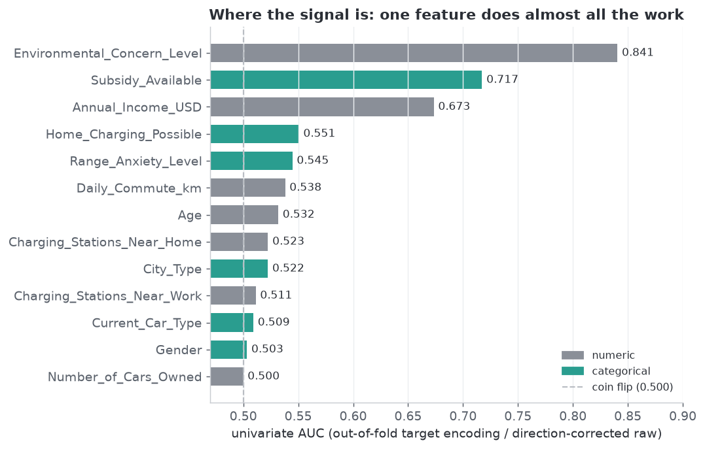
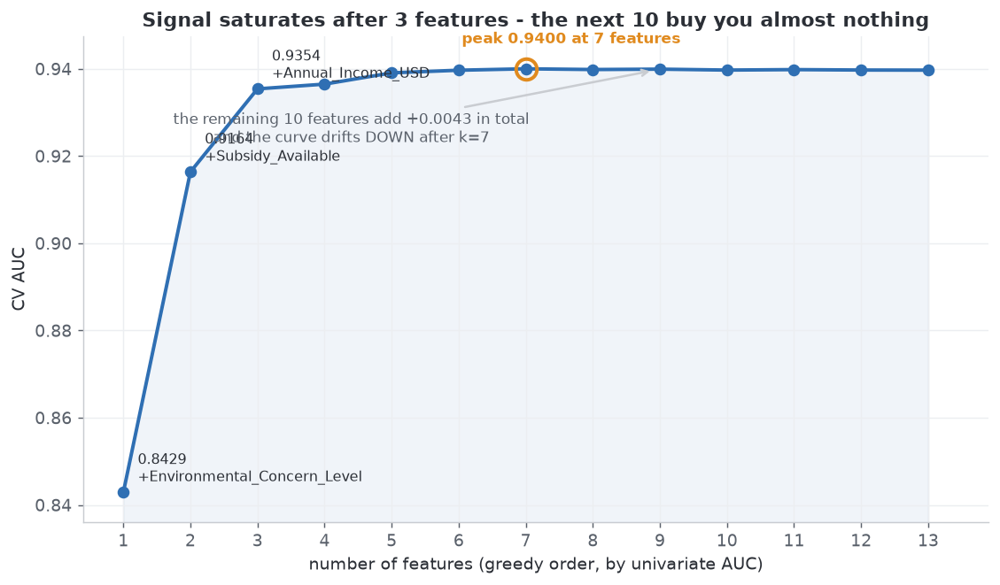
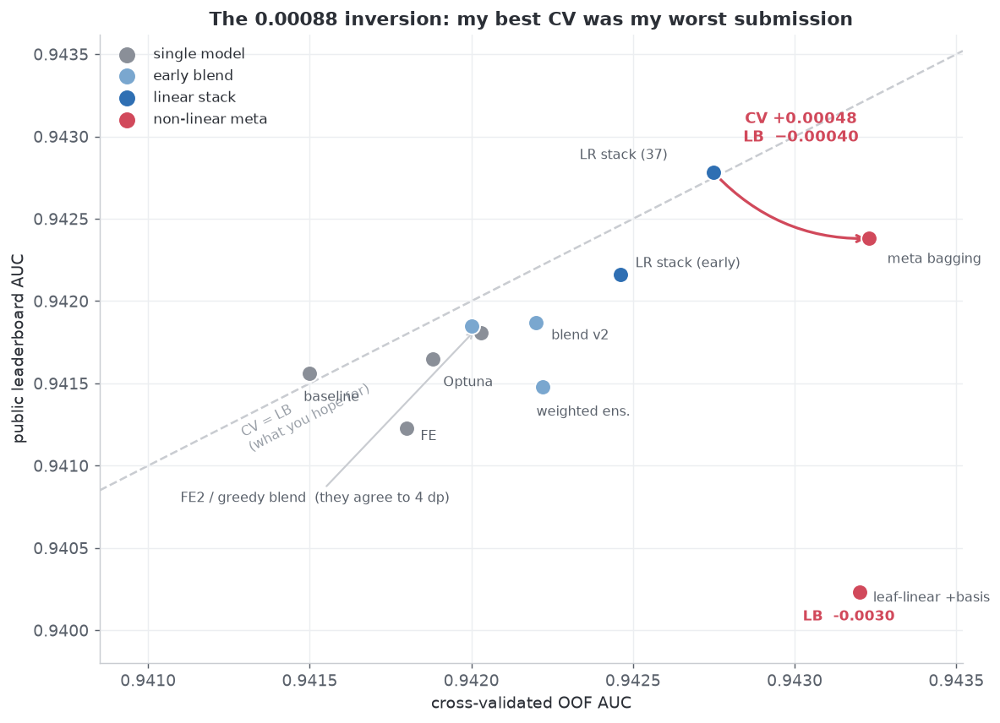
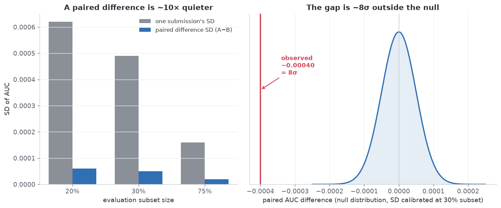
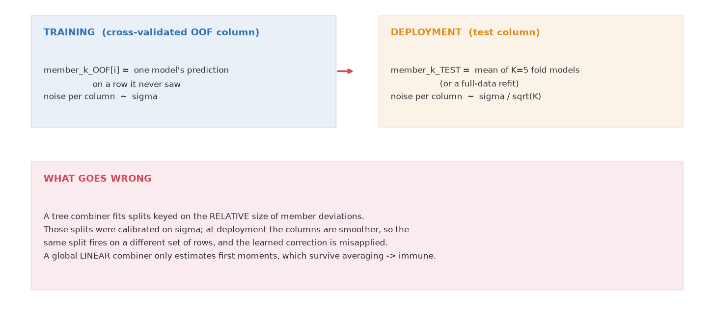

# Why I was stuck at 0.943 — 49 models, one silent bug, and a CV gain that didn't survive the leaderboard

**Kaggle Playground S6E9 — Predicting Electric Vehicle Purchases** · metric **ROC AUC** · 668,665 train / 286,571 test rows · 17.46% positives · CTGAN doubly-synthetic tabular data.

Final: **public LB 0.94278** (11 submissions, ~2,000 teams, top score 0.94672).

This repo is the write-up, the iteration log, and the scripts behind it. The point is not the score — it is the two failure modes worth knowing about, and the checklist at the end.

**Read it on Kaggle:** [S6E9 postmortem: CV up, LB down (49 models)](https://www.kaggle.com/code/avid147/s6e9-postmortem-cv-up-lb-down-49-models) — the same write-up, published as a Competition Notebook under Playground S6E9 (runs in ~3 s, no data needed).

---

## TL;DR

1. **The signal is absurdly concentrated.** One feature — `Environmental_Concern_Level` — alone gives **AUC 0.8435**. `Subsidy_Available` is a near-hard gate (**0.6%** buy rate when `No` vs **27.5%** when `Yes`). **3 features reach 0.9354**, and the CV curve **peaks at 7 features (0.9400)** — all 13 columns are no better. Almost all modelling effort goes into the last 0.004.
2. A **stack over 49 member models** got me to **CV 0.94275 / public LB 0.94278** with a **global linear** combiner (the shipped version used 37 of them after curation). That turned out to be my best submission.
3. I then **falsified 17 "obvious" improvements**, each with a measurement rather than an opinion (§3). That table is the part that saved the most time.
4. **The interesting result:** swapping the combiner from global-linear to a tree / leaf-linear stack raised cross-validated AUC **0.94275 → 0.94323 (+0.00048)** and *lowered* the leaderboard score **0.94278 → 0.94238 (−0.00040)**. A **0.00088 swing in the wrong direction** — and statistically solid at ≈8σ once leaderboard noise is calibrated as a *paired* difference.
5. **Root cause:** the members' **OOF columns were each the prediction of one model**; the **test columns were 5-fold averages**. Different **aggregation order** → the combiner fitted corrections calibrated to OOF-specific noise that is averaged away at inference. **Linear combiners are structurally immune; non-linear ones are not.**
6. A **normalisation bug** silently invalidated a whole round of my "model X contributes nothing (weight 0)" conclusions (it was a scale artefact, not a property of the models). If you've ever drawn that conclusion from a blend weight, read §4.

---

## Repo layout

```
notebooks/EV_S6E9_postmortem.ipynb   # the self-contained write-up (no data needed, runs in ~3 s, 5 figures)
docs/experiment-log.md               # chronological iteration log: every run, every number, every pitfall
docs/kaggle-listing.md               # the Kaggle title/description/Discussion copy + the publish checklist
scripts/                             # the scripts behind the numbers, in reading order:
  nb_feature_stats.py                #   §1 univariate AUCs + the greedy cumulative curve
  lb_vs_cv.py                        #   §2 CV ↔ LB offset table
  lb_noise2.py                       #   §5 paired-noise calibration (single vs paired SD)
  stack_final3.py                    #   §2 the 37-member linear stack  → the best submission
  stack_meta9.py                     #   §5 the non-linear meta + member-set bagging → the regression
  meta_transfer_diag.py              #   §6 the smoothness diagnostic that FAILED to clear it
  verify_s3_weights.py               #   §3 leave-one-out marginal value of each member
  make_notebook.py                   #   regenerates the notebook from inlined data
data/                                # tiny CSVs the notebook inlines (feature AUCs, cumulative curve, stats)
figures/                             # the 5 figures, as PNG
```

`scripts/*.py` expect the competition files at `data/train.csv` / `data/test.csv` and cache member predictions as `oof_*.npy` / `test_*.npy` in the working directory. They are research code: absolute paths, no CLI, several rounds deep. They are published for provenance, not as a library.

---

## 1. Where the signal actually is

Measured before optimising anything: raw-value AUC for numerics (direction-corrected), **out-of-fold** target encoding for categoricals, plus a 20-quantile target-encoded version of each numeric to catch non-monotone shape.



| feature | type | univariate AUC (raw) | univariate AUC (20-quantile OOF TE) |
|---|---|---|---|
| `Environmental_Concern_Level` | numeric | **0.8435** | 0.8406 |
| `Subsidy_Available` | categorical | — | **0.7173** |
| `Annual_Income_USD` | numeric | 0.6704 | 0.6734 |
| `Home_Charging_Possible` | categorical | — | 0.5507 |
| `Range_Anxiety_Level` | categorical | — | 0.5447 |
| `Daily_Commute_km` | numeric | 0.5338 | 0.5381 |
| `Age` | numeric | 0.5055 | 0.5318 |
| `Charging_Stations_Near_Home` | numeric | 0.5159 | 0.5225 |
| `City_Type` | categorical | — | 0.5224 |
| `Charging_Stations_Near_Work` | numeric | 0.5106 | 0.5113 |
| `Current_Car_Type` | categorical | — | 0.5092 |
| `Gender` | categorical | — | 0.5034 |
| `Number_of_Cars_Owned` | numeric | 0.5039 | 0.4999 |

Then the greedy forward build-up:



**3 features → 0.9354. Peak 0.9400 at 7 features. All 13 → 0.9397 — i.e. the last 6 columns make it *worse*.**

Two things to take from this:

- **`Environmental_Concern_Level` is the task.** Everything past the top three is noise-adjacent: six features sit between 0.499 and 0.545.
- **~96% of the achievable gain is in three columns.** Every idea you'll be tempted by next — more models, deeper models, more features — operates inside the remaining 0.0043. Measuring this early is what let me stop guessing and start *auditing*.

## 2. What actually moved the needle

| step | CV (cross-fitted OOF) |
|---|---|
| LightGBM baseline | 0.94150 |
| + feature engineering (FE2 view) | 0.94203 |
| + 19-member blend | 0.94220 |
| + more members (31) | 0.94254 |
| + curated member set (34 → 36 → 37) | 0.94272 → 0.94274 → **0.94275** |
| …then non-linear combiners | 0.94305 → 0.94313 → 0.94320 → 0.94323 ← **all of this was CV-only gain** |

Everything above 0.94275 is the story of §5: **real on cross-validation, negative on the leaderboard.**



The 0.00093 that *was* real came from ensembling, and mostly from **member diversity rather than member strength**:

- A **k-NN member with its own AUC of only 0.89751** was the single highest-value member in the pool (removing it cost **+0.00021**).
- Pruning the pool down to the 30 individually-strongest members cost **−0.00065**. **Diversity dominates strength; never prune by standalone AUC.**
- "More members" is **not monotone**: under the linear combiner 37 curated members (0.94275) beat 44 (0.94259) and 49 (0.94246).

## 3. Seventeen things that did not work

Every row is a **measured** result. Verdicts are based on standalone CV or on the leave-one-out marginal value in the corrected stack (`verify_s3_weights.py`), **not** on the raw blend weights that §4 shows were meaningless.

| # | idea | measured | verdict |
|---|---|---|---|
| 1 | Plain MLP / RealMLP-style net | 0.9367 (fold 0) | −0.0045 vs GBDT; LOO Δ +0.00000 — dropped |
| 2 | Logistic regression, one-hot + bins + interactions | 0.9394 | −0.0022; LOO Δ +0.00002 |
| 3 | ExtraTrees | 0.9392 | dropped |
| 4 | Monotone constraints (2 variants) | 0.9404 / 0.9404 | −0.0015; LOO Δ −0.00000; and 4 "obviously monotone" features aren't (Spearman −0.02) |
| 5 | RandomForest | 0.9407 | dropped |
| 6 | XGBoost | 0.9417 | ±0.0000 — kept as a member only |
| 7 | HistGradientBoosting (sklearn) | 0.9417 | ±0.0000 — kept as a member only |
| 8 | Nested cross target encoding, 9 key combos | 0.9415 | LOO Δ +0.00000 — dropped |
| 9 | CatBoost, `max_ctr_complexity=4` | 0.9416 | LOO Δ +0.00001 — dropped |
| 10 | Original source dataset (10k rows) added to training | 0.9417 | LOO Δ −0.00000 — 10k rows vs 669k |
| 11 | Original source dataset as the ONLY training set | 0.9377 (best of 4 capacities) | far worse |
| 12 | 10-fold instead of 5-fold + full-data refit | +0.00005 / +0.00000 | below noise for 3× the cost |
| 13 | Rank-averaging instead of probability-averaging | 0.94222 = 0.94222 | identical — members were already calibrated |
| 14 | Greedy weight search over 44 → 49 members | 0.94259 / 0.94245 | worse than the curated 37 (0.94275) |
| 15 | Nystroem RBF kernel approximation | 0.9349 | dropped |
| 16 | Pseudo-labelling | bounded by #12 | +25% real data bought +0.00005 → not worth it |
| 17 | Non-linear / leaf-linear stacking | CV 0.94303–0.94323 | **FALSIFIED ON LB: −0.0004 … −0.0030 (§5)** |

*"LOO Δ" = leave-one-out marginal value inside the **corrected** (gaussianised-rank) stack: refit the stack with that member removed and see what the full pool loses. Measured on all 49 discovered members, base = 0.94245 — see `scripts/verify_s3_weights.py`. Note this is deliberately **not** the raw blend weight, for the reason in §4.*

**Two details worth noticing in the re-measurement:**

- **CatBoost (FE2 view) carries a coefficient of +0.716 and still has zero marginal value.** The weight is not a value — it is absorbed from, and given back to, the correlated members it duplicates. **Reading a stack's coefficients as importances is a mistake regardless of scale.**
- **The MLP's coefficient is negative (−0.180).** It acts as a *decorrelator*, and a decorrelator with zero marginal value is one you can drop.

Three generalisable lessons:

1. **Synthetic tabular data punishes complexity.** Every "clever" model (MLP, kernel approximation, ExtraTrees) lost to a plain gradient-boosted tree. The generator is mostly monotone + one gate, and GBDTs already nail that shape.
2. **External data is not automatically a win.** This competition is generated from a real 10k-row dataset; adding it changed nothing. The *signal* has to be new, not just the *data*.
3. **Never draw a "this model is useless" conclusion from a blend weight** without checking the scale first (§4).

## 4. A silent bug that invalidated a whole round of conclusions

I used a greedy forward-selection blender that accumulated **unnormalised weighted sums** instead of normalised probabilities. Nothing raised an error — the "weights" looked sane and the internal AUC comparisons still ranked candidates. But the stored blend output had:

- min 0.0006, max **15.9**, mean 4.64
- **51.9% of values ≥ 1**

A downstream script then did the standard `clip(1e-6, 1-1e-6)` before taking a logit — which collapses every value above 1 to the same number. The blend's logit-space AUC read **0.7865** while its raw AUC was **0.9422**.



I spent a whole round concluding "model X contributes nothing (weight = 0)" before noticing. **Every one of those conclusions was an artefact of the scale, not a property of the model.**

**Rule I now follow:** before trusting *any* downstream metric on a blend, assert

```python
assert (0 <= p).all() and (p <= 1).all(), f"blend is not a probability: {p.min():.3g}..{p.max():.3g}"
```

and when comparing two candidates, compare them in the **same space** (both raw, or both gaussianised ranks) — never one raw and one logit.

## 5. The part worth your time: a CV gain that didn't survive the leaderboard

Up to §2 everything was conventional. Then the standard move: **replace the global linear combiner with something more expressive.**

| combiner | CV (cross-fitted OOF) | public LB |
|---|---|---|
| global linear (37 members) | **0.94275** | **0.94278** |
| shallow LightGBM, members only | 0.94301 | — |
| + raw features | 0.94303 | — |
| leaf-linear tree (`linear_tree=True`) | 0.94309 | — |
| + explicit basis (pairwise diffs, raw signals, PCA) | 0.94320 | 0.94023 |
| rank-average of several such metas | **0.94323** | 0.94238 |

The CV number rose **monotonically** with combiner expressiveness — a clean, believable **+0.00048**. The ablations were mutually consistent: the gain came from non-linearity *in member space* (members-only ≈ members + raw features), monotone constraints *hurt* (−0.00013, evidence the effect was real), and a smoothness diagnostic passed.

So I submitted it. **It scored lower than the linear stack** — and the fancier it was, the worse it did.

### It is not leaderboard noise

This is the part people skip, and it's the part that makes the result real. The public leaderboard scores only a fraction of the test rows, and a *single* submission's score wobbles a lot. I calibrated that wobble by resampling training rows (test labels are unobservable; same generative process, so row count is a fair scale proxy), 150 redraws:

| subset | SD of one submission's AUC | SD of the **paired** difference A−B |
|---|---|---|
| 20% (133,733 rows) | 0.00062 | 0.00006 |
| 30% (200,599 rows) | 0.00049 | 0.00005 |
| 75% (501,498 rows) | 0.00016 | 0.00002 |

Because two near-identical submissions (Spearman **0.9965**) share almost all of their mistakes, the **paired** difference is **~10× more stable** than either score alone. So the observed −0.00040 is **≈8σ — not noise**.

> **Practical rule:** to judge whether candidate A beats B, never compare their absolute LB scores. Compare the *paired difference*, and calibrate its SD the same way.

## 6. Root cause: the two sides have a different *aggregation order*

|  | training representation (what the combiner fits on) | deployment representation (what it's applied to) |
|---|---|---|
| member column = | the prediction of **one** model that never saw the row | the **average of K=5** fold models (or a full-data refit) |
| per-column noise | σ | ≈ σ/√K |
| measured mean pairwise \|corr\| of the member matrix | **0.9383** | **0.9519** |



Both columns are *honest* — no leakage anywhere. But they are **not the same random variable**: one carries a single model's idiosyncratic error, the other has had it averaged away.

A tree combiner can and will exploit that difference. It learns splits of the form *"member A is unusually high **relative to** member B"* — and the population of rows where that split fires depends on the **noise level** of the columns. Calibrate the splits on σ, deploy them on σ/√K, and the corrections land on the wrong rows. **The more expressive the combiner, the more of this it can fit** — which is exactly why CV rose monotonically with capacity while LB fell.

A **global linear** combiner is structurally immune: it estimates first moments only, and `E[average of K models] ≈ E[one model]`. It has nothing to mis-calibrate.

### Two honest caveats

- **I saw the mismatch coming and my diagnostic still passed.** I built a "pseudo-test" matrix by shrinking OOF columns toward the row consensus until their correlation matched the measured test-side value — the score held (0.94314 → 0.94313). I took that as clearance. It wasn't. **Lesson: reproducing one moment (correlation) of a distributional shift does not reproduce the shift.** If train and deployment representations come from different pipelines, CV on the training-side representation *structurally cannot* certify the combiner.
- **The PCA variant was catastrophic (−0.0030), and that part is more mundane:** PCA axes are the maximum-variance directions, and much of that variance *is* the between-side noise difference; fitting PCA per-fold for OOF but on all rows for deployment rotates the axes relative to what the meta learned. Coordinates derived from the training-side representation are the worst thing to hand a non-linear combiner.

### The fix (if you want to keep the non-linear combiner)

Do **not** change the combiner — change the representation so both sides have the **same aggregation order**:

> run **repeated K-fold with different seeds**, and for each row average its out-of-fold predictions **across replicates**. Then every OOF column = an average of K models that never saw that row, structurally identical to the test column.

Cost: K× training for the affected members (only the highest-weighted ~10 need it). **I did not run this round** — I'm reporting the diagnosis, not a validated fix. If you try it, I'd genuinely like to know whether it closes the gap.

## 7. Checklist for a dense leaderboard

1. **Find the ceiling before optimising.** One column gave 0.8435; all thirteen gave ~0.9400, peaking at 7. When the remaining headroom is 1e-5, stop tuning models and go do the audit — that's where every real finding was.
2. **Compare candidates on paired folds.** Identical splits for A and B, then look at `AUC_A − AUC_B`. Fold noise cancels; 1e-5 differences become meaningful.
3. **Calibrate leaderboard noise as a *paired* bootstrap**, not the SD of one submission (0.00049 vs 0.00005 here — a 10× difference in sensitivity).
4. **Never trust a non-linear combiner whose training and deployment inputs come from different pipelines.** CV structurally cannot see it. Match the aggregation order, or ship a linear combiner.
5. **Assert your blends are probabilities** before any logit/clip step (§4).
6. **More members is not monotonically better**, and **diversity dominates accuracy** — a 0.8975-AUC k-NN member added +0.00021; pruning to the 30 strongest cost −0.00065.
7. **Pin the exact member list** when screening. I once used "all members minus family F"; F grew from 4 to 6 names between rounds, silently changing the candidate set and making every option look worse.
8. **Re-measure a known answer after every refactor.** Two lines of code; it caught the drift in (7).

## 8. Reproduce

```bash
pip install numpy pandas scikit-learn lightgbm matplotlib
python scripts/nb_feature_stats.py      # §1 numbers -> data/*.csv  (needs data/train.csv)
python make_notebook.py                 # regenerate notebooks/EV_S6E9_postmortem.ipynb
```

The notebook itself needs **no data and no training** — every number is inlined, so you can fork and re-plot in seconds.

---

## 中文摘要

**任务**：Kaggle Playground S6E9（预测是否购买电动车，ROC AUC，66.9 万训练行，CTGAN 双合成数据）。**最终公开榜 0.94278**（提交 11 份）。

**三个最有价值的结论：**

1. **信号极度集中**：单个特征 `Environmental_Concern_Level` 就有 AUC 0.8435；3 个特征到 0.9354；**CV 在 7 个特征处见顶（0.9400），全部 13 个特征反而更差**。约 96% 的可达增益集中在 3 列里，其余努力都在抢最后 0.004。
2. **一个静默的归一化 bug**：贪心融合脚本存的是**未归一化的加权和**（最大值 15.9、51.9% 的值 ≥ 1），下游 `clip` + logit 后 AUC 从 0.9422 崩到 0.7865。我因此**整轮把"某成员权重=0、毫无贡献"的结论全部建立在假象上**。教训：信任任何融合指标前先断言它是概率。
3. **CV 涨、榜上跌（本文最核心的发现）**：把组合器从**全局线性**换成树/叶内线性后，CV 从 0.94275 单调涨到 0.94323（+0.00048），公开榜反而从 0.94278 掉到 **0.94238**，而换基版更是掉到 0.94023（−0.0030）。用**配对噪声**标定证明这不是榜噪声（配对差的 SD 只有 5e-5，−0.00040 ≈ 8σ）。**根因**：成员的 OOF 列是"单个未见该行的模型"的预测，而 test 列是 **5 折平均** —— 两侧**聚合阶数不同**。树能利用"成员 A 相对 B 偏高"这类分裂，而这类分裂是按 OOF 的噪声水平校准的，部署时噪声已被平均掉，修正落在错误的行上；**全局线性组合器只估一阶矩，结构上免疫**。PCA 换基会放大这个缺陷。

另外系统性证伪了 17 条"看起来该有用"的路（MLP/RealMLP、原始数据集联合训练、单调约束、DART、10 折与全量重训、秩平均、CatBoost CTR、RBF 核近似、伪标签……），每一条都有实测数字，见 §3。

---

<sub>All numbers are my own measurements. Competition: [Playground Series S6E9](https://www.kaggle.com/competitions/playground-series-s6e9) · Cross-validation: 5-fold stratified, fixed seed, paired across candidates. MIT licensed — the write-up and scripts are free to reuse.</sub>
